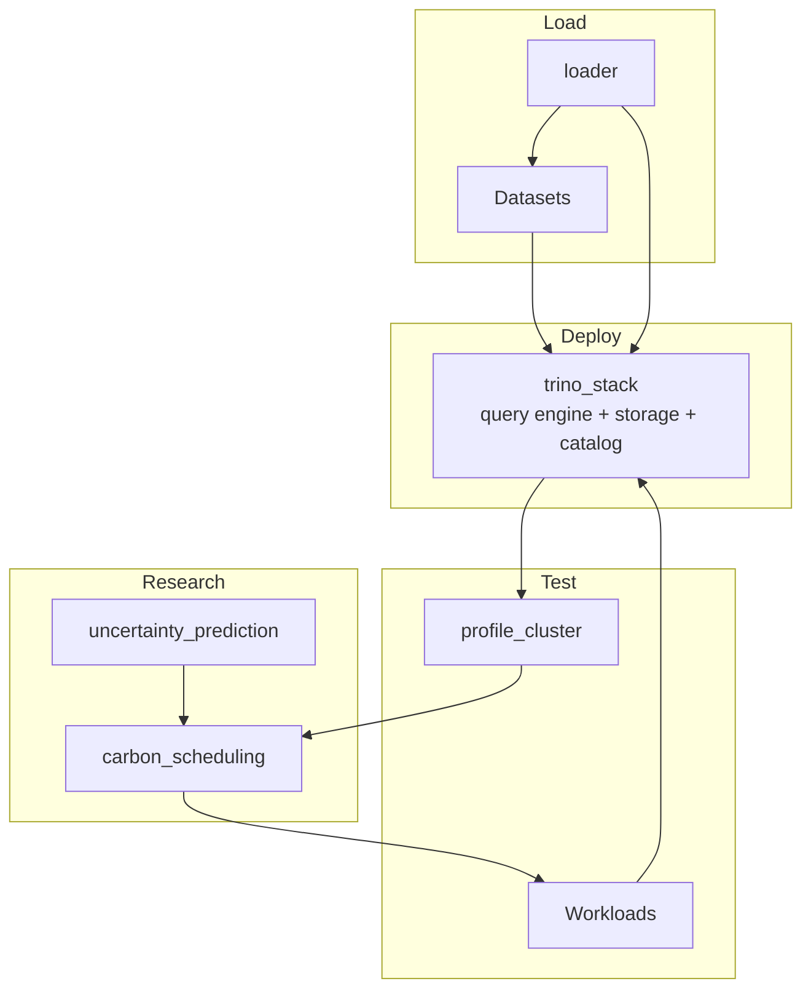

# LakehouseDock

**A central platform for deploying and testing lakehouses and query engines on Kubernetes.**

LakehouseDock stands up a complete data lakehouse on a Kubernetes cluster, loads it with
data, and runs query workloads against it so that different configurations, schedulers, and
engine settings can be benchmarked under controlled, repeatable conditions. Think of it as a
dry dock for lakehouses: a place to bring a stack in, work on it, and put it through its paces.

On top of the core deploy-and-test loop, LakehouseDock includes an experimental
**carbon-aware scheduling** layer driven by **uncertainty-aware forecasting**, for studying how
query workloads can be shifted in time to run when the electricity grid is cleaner.

> **Status:** Research / work in progress. Interfaces and layout may change.

---

## Why

Standing up a lakehouse (object storage + table format + catalog + a distributed query engine)
and then benchmarking it reproducibly is difficult and prone to many errors. LakehouseDock
packages the process as code so that a lakehouse can be deployed, loaded, exercised, and
measured with a consistent, version-controlled workflow in order to allow experiments (including
carbon-aware scheduling) to be re-run and compared fairly.

## Architecture



At a high level: `trino_stack` deploys the engine and storage layer, `loader` ingests
`Datasets` into it, `Workloads` drive queries against it, `profile_cluster` measures what
happens, and `carbon_scheduling` (informed by `uncertainty_prediction`) decides *when* work runs.

## Repository layout

| Directory | Purpose |
| --- | --- |
| [`trino_stack/`](trino_stack/) | Deploys the Trino query engine and the lakehouse storage/catalog layer onto Kubernetes. |
| [`loader/`](loader/) | Ingests datasets into the lakehouse and creates the tables that workloads query. |
| [`Datasets/`](Datasets/) | Source data (or fetch scripts) used to populate the lakehouse for tests and benchmarks. |
| [`Workloads/`](Workloads/) | The query workloads / benchmark definitions run against the deployed lakehouse. |
| [`profile_cluster/`](profile_cluster/) | Tools for profiling cluster resource usage and query performance during runs. |
| [`carbon_scheduling/`](carbon_scheduling/) | Carbon-aware scheduling of workloads based on grid carbon intensity. |
| [`uncertainty_prediction/`](uncertainty_prediction/) | Forecasting (with uncertainty) that feeds the carbon-aware scheduler. |

Top-level files:

| File | Purpose |
| --- | --- |
| `install.sh` | Bootstraps the environment / dependencies. <!-- TODO: confirm exactly what this installs --> |
| `launch_lakehouse.ipynb` | Notebook entry point for deploying and driving the lakehouse end to end. |
| `requirements.txt` | Python dependencies. |

## Prerequisites
- A Kubernetes cluster you can deploy to (e.g. a managed cluster, or a local one such as `kind`/`minikube`/`k3s`), with `kubectl` configured.
- Python 3.x and the packages in `requirements.txt`.
- Jupyter, to run `launch_lakehouse.ipynb`.
- Object storage for the lakehouse data layer (e.g. MinIO in-cluster, or an S3-compatible bucket). <!-- TODO: confirm -->

## Quick start

```bash
# 1. Clone
git clone https://github.com/JamesNurdin/LakehouseDock.git
cd LakehouseDock

# 2. Install dependencies / bootstrap the environment
./install.sh
pip install -r requirements.txt

# 3. Launch the lakehouse and run the end-to-end workflow
jupyter notebook launch_lakehouse.ipynb
```

A typical end-to-end run:

1. **Load** data into object storage — see [`loader/`](loader/) and [`Datasets/`](Datasets/).
2. **Deploy** the engine and storage layer — see [`trino_stack/`](trino_stack/).
3. **Run** workloads — see [`Workloads/`](Workloads/).
4. **Profile** the run — see [`profile_cluster/`](profile_cluster/).
5. *(Optional / research)* **Schedule** carbon-aware — see [`carbon_scheduling/`](carbon_scheduling/) and [`uncertainty_prediction/`](uncertainty_prediction/).

## Components

Each directory has its own README with details. Start with [`trino_stack/`](trino_stack/) to get
a lakehouse running, then [`loader/`](loader/) to put data in it.

## Citation
## License
